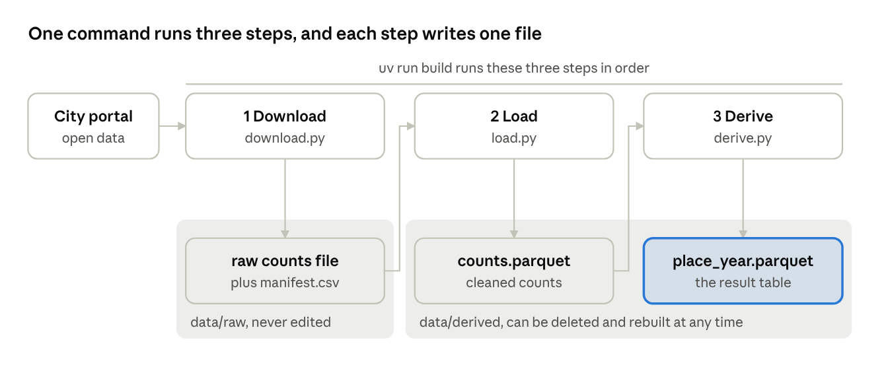
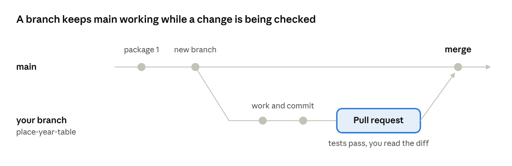

# DS-Projekt 2026 tutorial · Chapter 3 · From exploration to a pipeline

Oct 8, 2026 · Václav Pechtor

## What you have at the end

After this chapter one command builds your first result table from nothing, on any machine, and a test guards the logic behind it.

You get there in two small packages of work. The first goes straight to `main`. The second arrives through your first branch and pull request.

Nothing is handed to you on the way. The command, the pipeline and the tests are all created by prompts you will see here, and each piece is explained where it first appears.

## Move what you found out of the notebook

A notebook is where you find out. A pipeline is where you keep what you found.

The result from chapter 2 is real, but it has three weaknesses:

- It lives on one machine, in cells that someone ran by hand.
- It rests on a file that was downloaded once, and nobody recorded which version.
- No test guards its logic, so a small change can break it without anyone noticing.

A pipeline fixes all three. It is a sequence of steps behind one command, and that command builds every table from nothing. A teammate, or you in three months, runs it and gets the same result.

Not everything moves. Only a result you will need again is worth this effort. For us that is the table from the one-pager: one row per place and year.

Before building, the two open choices went into the log as a decision: which source file the pipeline uses, and what the first table contains. See [docs/log.md](https://github.com/vp-82/ds-projekt-2026-tutorial/blob/main/docs/log.md).

## What a pipeline is

A pipeline is a fixed sequence of steps behind one command. Each step reads one file and writes the next.

In the notebook you ran cells by hand, in an order that only you knew. A pipeline writes that order down as code, so a computer can repeat it without you.



Read it from left to right: download fetches the raw file from the portal, load turns it into a clean copy, and derive turns the clean copy into the result table.

Each step answers one question:

| Step | Question it answers | In our project |
| --- | --- | --- |
| Download | Where does my raw data come from? | Fetches one file from the city's portal and records what it fetched |
| Load | What does a clean version of it look like? | Turns the date column from text into real timestamps |
| Derive | Which table answers my question? | Computes one row per place and year |

Why separate steps and not one long script?

- **You can check each step on its own.** When a number looks wrong, you know which step to open.
- **A finished step is skipped.** If its output file exists, the step does nothing. A second run is fast.
- **Each step has one job.** Fetching, cleaning and computing do not get mixed up.

The data lives in two folders with different rules:

- `data/raw` holds the file exactly as it was downloaded. Nobody edits it, and only the download step writes there.
- `data/derived` holds everything the pipeline computed. You can delete it at any time, because one command recreates it.

Neither folder is stored in git. The data is large, and the code can rebuild it.

Your own pipeline will look different. You may have five sources or steps with other names. The pattern stays the same: one command, steps in a fixed order, and each step with one input and one output.

## Slice the work into packages you can check

Size a piece of work by what you can check, not by what the agent can write.

Claude Code writes a thousand lines in ten minutes. Nobody can verify a thousand lines. So the work is cut into packages, and each package is one unit of work.

A unit of work has four properties:

- It has one purpose that you can say in a sentence.
- It has its own check, and you know that check before you start.
- The project still works after it is merged.
- It is small enough to read in ten minutes and to finish in a day. As a rule of thumb, stay under 200 changed lines.

How to cut:

- **Cut where something can be run and checked on its own,** not along files.
- **Go thin and end to end first.** One source and one table. Widen later.
- **Finding out is not a package.** The result you decide to keep is.
- **Put first the package that could prove the approach wrong.**

Plan mode is your slicing tool. Press Shift+Tab in Claude Code until plan mode shows. The agent then reads and proposes, but changes nothing until you approve. If the plan is bigger than you can check, that is where you cut.

We cut the pipeline into two packages:

| Package | Purpose | Check |
| --- | --- | --- |
| 1 | One command exists and downloads the raw file | Run it twice: the first run writes, the second skips |
| 2 | The command also produces the table per place and year | A test on a hand-made example, and the same numbers as the notebook |

## Know what a test is before you ask for one

A test is a small program that runs one of your functions on an input you chose and compares the result with the answer you already know.

Both packages include tests, so here is how they work.

**pytest** is the tool that finds and runs them. It looks in the `tests/` folder for files named `test_*.py` and runs every function in them whose name starts with `test_`. Each of these functions ends in an `assert`, which is a claim that must be true. You run all tests with one command:

```
uv run pytest
```

A dot means a test passed. On a failure pytest shows the value it expected next to the value it got.

Who writes what:

- **You write the input and the expected answer.** That is the thinking.
- **The agent writes the test code.** That is the typing.
- **You read the test.** You do not need to write pytest by hand, but you must be able to see what a test claims.

How to ask for one: put the input and the exact expected output into your prompt. You will see this in package 2.

A test that cannot fail checks nothing. So make every new test fail once: change one expected number, run the tests, see the failure, and change it back.

A passing test has a limit you should know. It proves that the function does what you specified, on the cases you thought of. Whether the result is right on the real data is a separate check, which comes later in this chapter.

Two things that confuse beginners:

- We call the small hand-made input a fixture. pytest uses the same word for one of its own features, so a web search for "pytest fixture" leads somewhere else.
- Tests never read from `data/`. They run in a second and give the same result on every machine.

To try pytest yourself, work through its [Get Started](https://docs.pytest.org/en/stable/getting-started.html) page.

## Package 1: one command and the download step

The first package creates the command itself and gives it a single step, the download.

In plan mode:

```text
I want one command, uv run build, that builds this project's data from nothing.
In this first package it has a single step, download.
Download fetches
https://data.stadt-zuerich.ch/dataset/ted_taz_verkehrszaehlungen_werte_fussgaenger_velo/download/verkehrszaehlungen_werte_fussgaenger_velo_alle_jahre.parquet
into data/raw and appends one line to data/raw/manifest.csv with the url, the
date, the size in bytes and the sha256 of the file.
It skips the download when the file is already there, and a --force option
fetches it again.
Every step prints one line saying what it wrote or that it skipped.
Include a test for the download step that runs without the network.
Later steps come in the next package, so do not add them or placeholders for
them.
Do not change probe.py or the files in docs.
In your plan, explain how the command uv run build comes to exist and what you
need to add to the project for it.
```

The prompt states rules, and each rule has a reason:

| Rule | Reason |
| --- | --- |
| Only the download step writes to `data/raw` | You can always say where a number came from |
| One manifest line per download | You know which version of the source you built from |
| Skip when the output exists, `--force` to redo | A second run is cheap, and a rebuild is one flag away |
| Every step prints one line | You see what happened without opening a file |
| No later steps, no placeholders | The package stays small enough to check |

The plan stayed inside these limits, so there was nothing to trim. A plan grows where the prompt leaves room.

**Where `uv run build` comes from.** `build` is not a uv command. It is a name this project defines. The agent's plan explained it in three parts:

1. Code with a `main()` function, in a package under `src/`.
2. One line in `pyproject.toml` that gives this function a name: `build = "ds_projekt_2026_tutorial.build:main"`.
3. A build-system entry in `pyproject.toml`, so that uv installs the project itself into its environment. That creates the command.

`uv run build` then means: run the command named `build` inside this project's environment. You will not write any of this by hand, but now you know what it does. See [build.py](https://github.com/vp-82/ds-projekt-2026-tutorial/blob/main/src/ds_projekt_2026_tutorial/build.py) and [pyproject.toml](https://github.com/vp-82/ds-projekt-2026-tutorial/blob/main/pyproject.toml).

**Check it yourself.** The agent ran the checks too, but checking is your part:

```
uv run pytest -q
uv run build
uv run build
uv run build --force
cat data/raw/manifest.csv
```

The first build wrote the file, the second skipped it, and the forced one fetched it again. Every manifest line carried the same sha256.

The manifest paid off the same day. The file on the portal had grown since the day before, because the city adds data daily. Your process can be reproducible while the source is not stable. The manifest tells you which version you built from.

This package was committed straight to `main`, for the last time.

## Write the answer down before the code

Before the agent writes the logic, you write a tiny example by hand and work out its answer yourself.

This example is the fixture. It is small enough to check in your head, and it contains the cases that exploration taught you to worry about.

| Site ID | Coordinates | Day | Bikes per quarter hour (in + out) | Why this row is here |
| --- | --- | --- | --- | --- |
| 1 | 1000 / 2000 | 1 March 2019 | 3+1, then 2+0 | Place A, two quarter hours on one day |
| 1 | 1000 / 2000 | 2 March 2019 | 4+0 | Place A, a second day |
| 2 | 1000 / 2000 | 1 March 2020 | 1+1, then 2+2 | Place A under a new ID |
| 3 | 3000 / 4000 | 1 March 2020 | 10+0 | Place B |
| 4 | 5000 / 6000 | 1 March 2020 | pedestrians only | Must not appear in the result |

The expected table, known before any code exists:

| Place | Year | Days with data | Bikes per day |
| --- | --- | --- | --- |
| A | 2019 | 2 | 5 |
| A | 2020 | 1 | 6 |
| B | 2020 | 1 | 10 |

Three lessons from chapter 2 are built in: an ID change stays one place, days are counted and averaged correctly, and a site without bikes stays out.

The fixture is yours. The agent may use it but must not change it. If the code and the fixture disagree, the code is wrong until you decide otherwise.

## Work on a branch and merge through a pull request

Once `main` has a working build, no change goes into it directly. A change arrives on a branch and through a pull request.

Three words to know:

- A **branch** is a separate line of work in the same repository. You change files and commit there, while `main` stays as it is and keeps working.
- A **pull request** is a proposal to bring a branch into `main`. It lives on GitHub and shows exactly what would change. That view is called the diff.
- A **merge** accepts the proposal. From then on `main` contains the change.



Read it from left to right: package 1 sits on `main`, package 2 is built on its own branch, and only the pull request brings it back.

Why do this on a small project?

- **`main` always works.** A teammate who pulls it gets a build that runs.
- **One pull request is one package.** The unit of work becomes visible, easy to read and easy to undo.
- **It gives the check a place.** Before the merge someone reads the diff. Today that is you. In chapter 4 automated checks and a reviewer join in.

You do not have to type git commands for this. Ask Claude Code to create the branch, commit, push and open the pull request. Reading the diff and merging stay with you.

To learn more:

- [Hello World](https://docs.github.com/en/get-started/start-your-journey/hello-world) is GitHub's hands-on tutorial. You create a branch, commit, open a pull request and merge it, all in the browser.
- [GitHub flow](https://docs.github.com/en/get-started/using-github/github-flow) describes the same way of working in six steps.
- [Branches in a Nutshell](https://git-scm.com/book/en/v2/Git-Branching-Branches-in-a-Nutshell) from the Pro Git book explains what a branch is inside git.

## Package 2: load and derive

The second package adds two steps to the command: load makes a clean copy of the raw data, and derive writes the table per place and year.

In plan mode:

```text
Second package, on a new branch named place-year-table.
Add two steps to uv run build after download.

Load reads the raw file and writes a clean copy to data/derived with DATUM as a
real timestamp.
Its printed line also gives the first and last date in the data.

Derive writes the first table from docs/log.md: one row per place and year, with
the number of days that have bike data and the average number of bikes per day
on those days.
A place is a coordinate pair (OST, NORD), not a site ID.
Bikes are VELO_IN plus VELO_OUT.
Sites without bike counts do not appear.

Put the logic in functions that take a table and return a table, so a test can
run them on a fixture and never read from data/.
Create tests/fixtures/counts_small.csv with exactly this content and do not
change it.
If the real file does not fit its format, tell me.

FK_STANDORT,DATUM,VELO_IN,VELO_OUT,FUSS_IN,FUSS_OUT,OST,NORD
1,2019-03-01T08:00,3,1,,,1000,2000
1,2019-03-01T08:15,2,0,,,1000,2000
1,2019-03-02T08:00,4,0,,,1000,2000
2,2020-03-01T08:00,1,1,,,1000,2000
2,2020-03-01T08:15,2,2,,,1000,2000
3,2020-03-01T08:00,10,0,,,3000,4000
4,2020-03-01T08:00,,,5,7,5000,6000

The test must find exactly these rows: place 1000/2000 in 2019 with 2 days and 5
bikes per day, place 1000/2000 in 2020 with 1 day and 6 bikes per day, place
3000/4000 in 2020 with 1 day and 10 bikes per day.

Both steps follow the rules of the download step: one printed line, skip when
the output exists, --force rebuilds.
Do not change probe.py or the files in docs.
If this comes to more than about 200 lines of change, propose how to split it.
Do not commit until I say so.
```

Three sentences in this prompt are worth copying:

- **"Do not change it"** keeps the fixture yours.
- **"Functions that take a table and return a table"** is what makes the logic testable without the real data.
- **"More than about 200 lines, propose how to split it"** hands your slicing rule to the agent. Its plan came to about 150 lines, so the package stayed whole.

**The agent asked before it built.** While planning it looked at the real file and found something the fixture did not cover: more than a million rows have a count for one direction only. It asked how to treat them, and it noted that the test could not decide this.

The answer has three parts, and the order matters:

1. **Decide.** A missing direction counts as 0, because some counters count one direction only. Dropping those rows would remove whole counters.
2. **Pin it in the fixture.** One more row for place B, with 5 bikes in one direction and nothing in the other. The expected value for place B rises from 10 to 15.
3. **Log it.** The decision and its reason go into the log.

A rule that lives only in the code gets lost. A rule in the fixture is tested on every run, and a rule in the log can be found by the next person.

**Read the test the agent wrote.** It has three parts: load the fixture, call the function, compare with your table.

```
def test_place_year_table_on_fixture():
    table = place_year_table(parse_counts(pl.read_csv(FIXTURE)))
    expected = pl.DataFrame(
        {
            "OST": [1000, 1000, 3000],
            "NORD": [2000, 2000, 4000],
            "year": [2019, 2020, 2020],
            "days_with_bikes": [2, 1, 1],
            "bikes_per_day": [5.0, 6.0, 15.0],
        }
    )
    assert_frame_equal(table, expected, check_dtypes=False)
```

The numbers in `expected` are your table from the fixture section, with the 15 from the added row. The last line is the claim: the function's result equals your answer.

Results: [derive.py](https://github.com/vp-82/ds-projekt-2026-tutorial/blob/main/src/ds_projekt_2026_tutorial/derive.py), [test\_derive.py](https://github.com/vp-82/ds-projekt-2026-tutorial/blob/main/tests/test_derive.py), [counts\_small.csv](https://github.com/vp-82/ds-projekt-2026-tutorial/blob/main/tests/fixtures/counts_small.csv)

## Take the tour: what is in the repository now

After two packages the repository holds about a dozen files, and each has one job. This tour shows what they are and what happens when you run the command.

**What happens when you type `uv run build`**

1. uv makes sure the project's own Python environment has every package the project needs, and installs what is missing.
2. uv looks up the name `build`. The file `pyproject.toml` says that it means the function `main()` in `build.py`.
3. `main()` calls the three steps in order and hands each one the file that the step before it wrote.
4. Each step first looks whether its output file is already there. If it is, the step prints "skipped". If not, it does its work, writes the file and prints one line.

These three lines in `build.py` are the whole pipeline:

```
raw = download(URL, RAW_DIR, force=args.force)
counts = load(raw, DERIVED_DIR / "counts.parquet", force=args.force)
derive(counts, DERIVED_DIR / "place_year.parquet", force=args.force)
```

And this is what a run prints after `data/derived` was deleted, with the paths shortened:

```
download: skipped, data/raw/verkehrszaehlungen_werte_fussgaenger_velo_alle_jahre.parquet already exists
load: wrote data/derived/counts.parquet (15754053 rows, 2009-12-02 to 2026-10-05)
derive: wrote data/derived/place_year.parquet (367 place-years, 44 places)
```

Every line comes from one step. Download had nothing to do, and the other two rebuilt their files.

**What is inside a step**

Each step is one file. Here is the load step, the shortest of the three:

```
def parse_counts(raw: pl.DataFrame) -> pl.DataFrame:
    """Return the raw counts with DATUM as a real timestamp."""
    return raw.with_columns(pl.col("DATUM").str.to_datetime("%Y-%m-%dT%H:%M", strict=True))


def load(raw_path: Path, out_path: Path, force: bool = False) -> Path:
    """Write a clean copy of the raw file to out_path, unless it is already there."""
    if out_path.exists() and not force:
        print(f"load: skipped, {out_path} already exists")
        return out_path

    counts = parse_counts(pl.read_parquet(raw_path))
    out_path.parent.mkdir(parents=True, exist_ok=True)
    # Write to a .part file first so an interrupted run never looks complete.
    part = out_path.with_name(out_path.name + ".part")
    counts.write_parquet(part)
    part.replace(out_path)

    first, last = counts["DATUM"].min(), counts["DATUM"].max()
    print(f"load: wrote {out_path} ({counts.height} rows, {first:%Y-%m-%d} to {last:%Y-%m-%d})")
    return out_path
```

- `parse_counts` is the logic. It takes a table and returns a table, and it touches no files. This is the function the test calls.
- `load` is the housekeeping. It checks whether the work is already done, reads the input, calls the logic, writes the output and prints one line.

The derive step is built the same way, with the table logic in one function and the housekeeping in another. The download step has only the housekeeping, because it computes nothing. Once you can read one step, you can read them all.

**`pyproject.toml`, block by block**

This file describes the project. uv and the agent write it, and you should be able to read it.

| Block | What it says |
| --- | --- |
| `[project]` | The project's name and the Python version it needs |
| `dependencies` | The packages the code uses, here marimo and polars. `uv add` writes this list |
| `[project.scripts]` | The line that gives the function `main()` the name `build` |
| `[build-system]` | Tells uv to install the project itself, which is what makes the `build` command exist |
| `[dependency-groups]` | Packages needed only while developing, here pytest |

**What every file is for**

| Path | What it is | In git |
| --- | --- | --- |
| `src/ds_projekt_2026_tutorial/` | The pipeline code: `build.py` and one file per step | Yes |
| `tests/` | The tests, and the fixture in `tests/fixtures/` | Yes |
| `docs/` | One-pager, assumptions and log | Yes |
| `probe.py` | The exploration notebook from chapter 2 | Yes |
| `pyproject.toml` | The project description | Yes |
| `uv.lock` | The exact version of every package. uv writes it, nobody edits it | Yes |
| `.python-version` | The Python version uv uses for this project | Yes |
| `.gitignore` | The list of what git leaves out | Yes |
| `.venv/` | The project's own Python environment. uv creates it | No |
| `data/raw/` and `data/derived/` | The data | No |

The last column follows one rule. Git holds everything a teammate needs to rebuild the project. What git leaves out can be recreated with two commands: `uv sync` for the environment and `uv run build` for the data.

For more on these files, see [Working on projects](https://docs.astral.sh/uv/guides/projects/) in the uv documentation.

## Check against something independent

Green tests are the first check, not the last. A result is trustworthy when it also survives a rebuild and agrees with something that was worked out another way.

We ran three checks, from cheap to strong.

**1. Can the test fail?** We changed the expected 15 to 16 and ran the tests. One test failed. We changed it back, and all four passed. Now we know the test looks at the result.

**2. Does a rebuild give the same table?** Everything in `data/derived` must come from the raw file plus the code. So delete it and build again:

```
uv run pytest -q
uv run build
rm -r data/derived && uv run build
```

The rebuild wrote the same table as before: 367 rows for 44 places. This is what happens on a teammate's machine, where the derived data has never existed.

**3. Does it agree with the notebook?** The notebook in chapter 2 counted 44 places, 5 of them with data in every year from 2010 to 2025. It got there with rough code in a few cells. The pipeline got there with tested functions. Two different routes to the same numbers is strong evidence.

```text
Without changing any file: from data/derived/place_year.parquet tell me the
number of places and the number of places that have a row in every year from
2010 to 2025.
The notebook found 44 and 5.
From data/derived/counts.parquet tell me how many combinations of place and
quarter hour have rows from more than one site ID.
Report the three numbers and any difference from the notebook.
```

Both numbers matched. The third question in that prompt tested a risk in our own logic: when two site IDs share a place, their counts are added, which would count twice if both ever reported the same quarter hour.

It happened exactly once. At one ID switch, a single quarter hour is recorded under the old and the new ID. That is too small to change any conclusion, and too real to hide. It went into the log as a known limit, and fixing it is a package for chapter 5.

A check that asks a precise question can find a precise flaw. "Looks plausible" would never have found this one.

## Log it, open the pull request, merge

A package is finished when the log says what was delegated and checked, and the pull request is merged.

**The log gets an "AI use" entry.** It records who did what, and which checks the work passed. This is the entry from package 2:

```text
## AI use · 2026-10-08 · load and derive steps

Delegated: the load and derive steps of uv run build, the functions parse_counts
and place_year_table, and the test code.

Mine: the fixture tests/fixtures/counts_small.csv and the expected table the
test checks against.

Checks passed:
- Four tests green.
- The same table after deleting data/derived and rebuilding (367 place-years).
- 44 places, 5 of them reporting in every year from 2010 to 2025, as in the
  notebook.
```

The entry is short because the split is clear: the agent wrote the code, and the answer and the checks were ours. If you cannot fill in the "Mine" line, you delegated too much.

**Claude Code opens the pull request.** After the log entries, the prompt ended like this:

```text
Commit everything on this branch, push it and open a pull request.
The description says in one sentence what the package does, lists the checks
with their numbers and names the known limit.
```

**You read the diff and merge.** Open the pull request on GitHub and go to the tab that shows the changed files. Three questions are enough for a first read:

- Are these the files I expected, and no others?
- Is my fixture unchanged?
- Does the description match what I checked?

Our pull request changed 8 files and added 160 lines, which is under the limit from the slicing section. Everything was as expected, so we merged it: [pull request 1](https://github.com/vp-82/ds-projekt-2026-tutorial/pull/1).

After the merge, ask Claude Code to switch back to `main` and pull, so the next package starts from the merged state.

The table exists now, but the question is not answered yet. Which places can be compared across years, and what counts as growth, are still open in the one-pager. Chapter 4 first makes the checks run by themselves on every pull request. Chapter 5 then returns to the question.

## For your own project

1. Pick the one result from your notebook that you will need again, and log what the first table contains.
2. Cut the work into packages. Each has one purpose, its own check, and fewer than about 200 changed lines.
3. Start with one command and the download step, in plan mode. Run it twice and read the manifest.
4. Write a fixture by hand and work out its answer before any logic exists.
5. Build the next package on a branch. Put the fixture and the expected rows into the prompt.
6. When the agent asks a question the fixture cannot answer, decide, pin the rule in the fixture, and log it.
7. Check three ways: make the test fail once, rebuild from nothing, and compare with your notebook.
8. Write the AI use entry, let Claude Code open the pull request, then read the diff and merge it yourself.

---

Previous: [Chapter 2 · Test what can break your project first](chapter-2.md) · [Overview](README.md) · Next: [Chapter 4 · Checks that run without you](chapter-4.md)
