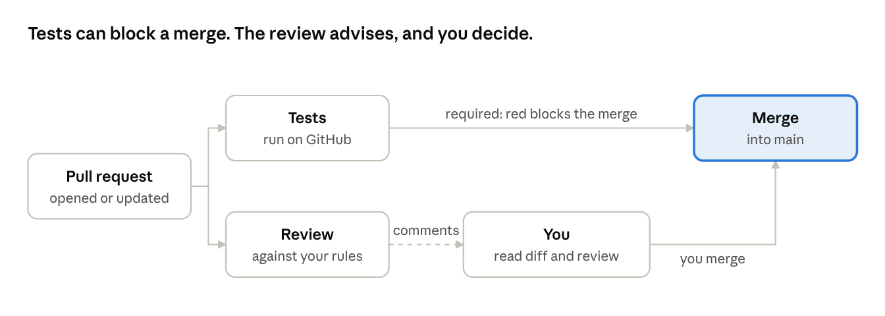
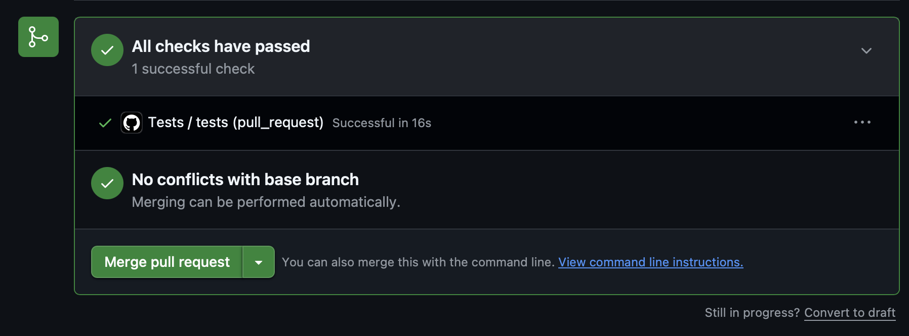
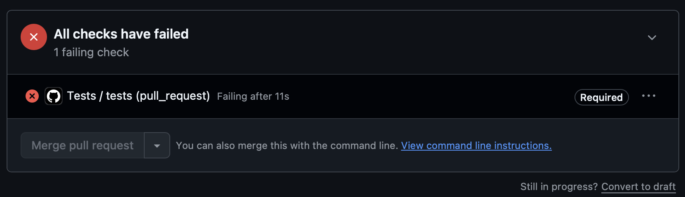
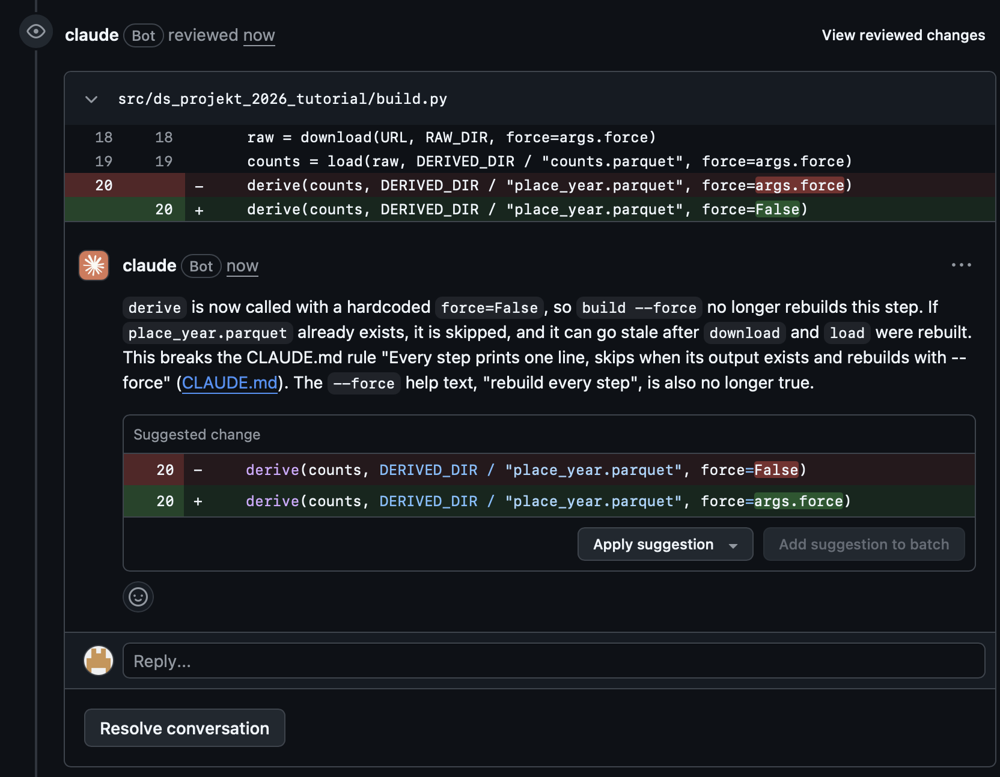
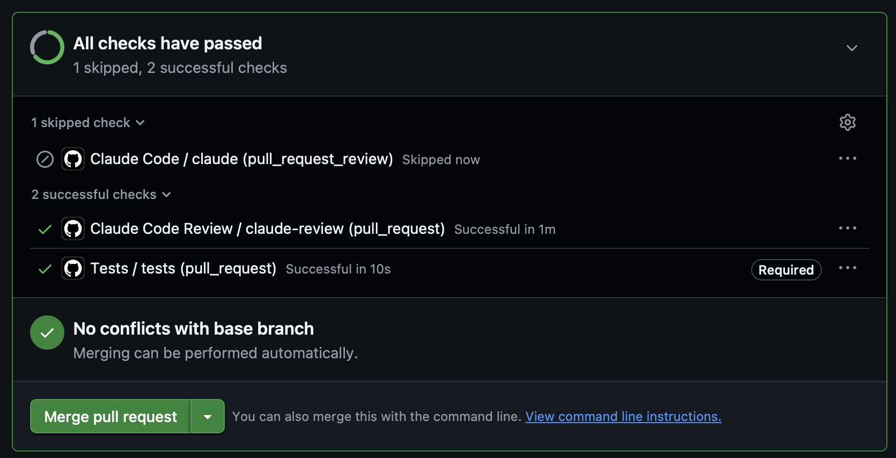
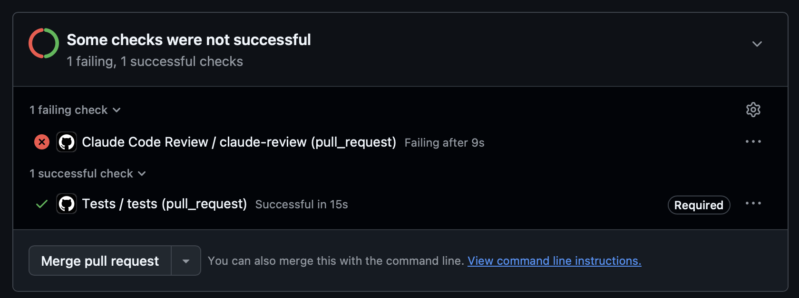
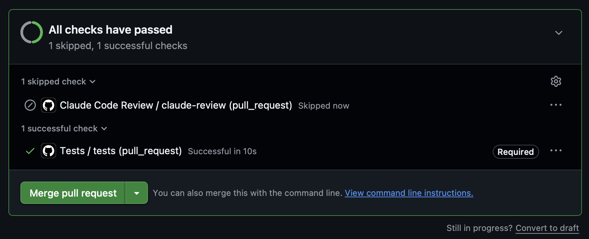

# DS-Projekt 2026 tutorial · Chapter 4 · Checks that run without you

Oct 9, 2026 · Václav Pechtor

## What you have at the end

After this chapter every pull request is checked before you look at it: the tests run by themselves, a red result blocks the merge, and a reviewer reads the change against your own rules.

In chapter 3 you did every check by hand. That works for one package. It does not last for a semester, and it does not work in a team, because a check that depends on someone remembering it will be forgotten.

So this chapter moves three things out of your head and into the repository:

- **Your rules** go into a file that the agent reads at the start of every session.
- **Your tests** run on GitHub for every pull request, and a failing test blocks the merge.
- **A review** reads every pull request against your rules and comments on what it finds.



None of this replaces you. The tests can only check what you specified, and the review only advises. You still read the diff and you still press the merge button.

## Write your rules down once

Whatever you had to tell the agent more than once belongs in a file it reads by itself.

Look back at the prompts in chapter 3. They kept repeating the same sentences: plan first, stay under 200 lines, tests never read `data/`, do not change my fixture. Repeating them costs effort, and the day you forget one, the agent does not know it.

Claude Code has a place for this. A file named `CLAUDE.md` in the root of the repository is loaded at the start of every session. It is committed like any other file, so everyone on the team works under the same rules.

This is the core of the prompt. It gives the rules as a list and asks for nothing beyond them. As run, it also named the branch and asked for a pull request at the end:

```text
Create CLAUDE.md with the rules I have been repeating in my prompts, so I can
stop repeating them.
One line per rule, with its reason in a few words, grouped under short headings,
at most 30 lines.
Take the rules from this list and do not add others:

- Plan before changing files, and wait for my go.
- One package per pull request, with one purpose and under about 200 changed
  lines.
  Propose a split when it would be larger.
- Never commit to main.
  Work on a branch, and commit and push only when I say so.
- Only the download step writes to data/raw, with one manifest line per
  download.
- Every step prints one line, skips when its output exists and rebuilds with
  --force.
- Logic lives in functions that take a table and return a table.
- Tests run on fixtures in tests/fixtures and never read data/.
- Fixtures and expected values are mine.
  Do not change them.
  Tell me when code and fixture disagree.
- Notebook cells you create have visible code.
- Decisions, hypotheses and AI use go into docs/log.md, in the form of the
  entries already there.
- Where I have not decided something, ask or mark it as open.
  Do not fill the gap.
```

Three things make a rules file work:

- **Keep it short.** Ours started with 22 lines. The agent follows a short and specific list more reliably than a long one.
- **Give every rule its reason.** A rule with a reason gets applied sensibly to cases you did not foresee.
- **Write only rules you really have.** These eleven all come from prompts that were run. None was invented for the file.

**The proof came with the next prompt.** It asked for a workflow that runs the tests and said nothing about planning, branches, commits or the log. In a fresh session the agent planned first and waited, worked on a branch, held the commit until told, and wrote the log entry. None of that was in the prompt.

The rules file is context for the agent. It is not a lock. If something must be impossible, and not just discouraged, it needs a mechanism, and the next two sections add one.

Result: [CLAUDE.md](https://github.com/vp-82/ds-projekt-2026-tutorial/blob/main/CLAUDE.md). More in the Claude Code documentation: [How Claude remembers your project](https://code.claude.com/docs/en/memory).

## Let CI run your tests on every pull request

A test that runs only when you remember it will not run on the day it matters. CI runs it for you, every time.

CI stands for continuous integration. On GitHub the tool for it is GitHub Actions: a file in the repository, called a workflow, says what should happen when something changes. GitHub then starts a fresh machine, follows the file and reports the result on the pull request.

Our workflow does three things on every pull request and on every push to `main`: it installs uv, installs the project, and runs the tests.

The prompt:

```text
The rules-file pull request is merged.
Switch to main and pull.
Then add CI: a GitHub Actions workflow that runs the tests on every pull request
and on every push to main.
Set up uv the way its documentation recommends for GitHub Actions.
Do not run uv run build in CI, because it downloads the full raw file.
```

The prompt holds the three decisions that are yours: when the tests run, whose instructions the setup follows, and what CI must not do. Everything else is left to the agent and to the rules file.



The green check means that the tests passed on a machine nobody set up by hand. Four things in the workflow are worth understanding:

- **A fresh machine every time.** Nothing from your laptop is there. Tests that pass on it do not depend on your own setup.
- **A locked install.** The line `uv sync --locked` installs exactly the package versions in `uv.lock`, and it fails when that file is out of date. Everyone gets the same packages, and so does CI.
- **Pinned versions.** The workflow names the uv version and fixes both actions to an exact commit. An action is someone else's code running inside your repository, so the trust rule from chapter 2 applies here too. The one that installs uv is published by Astral, the maker of uv.
- **No build.** The tests run on fixtures and never read `data/`, so CI needs no download. This is where that rule from chapter 3 pays off.

The agent also raised a risk in its plan before it could bite: the uv on my machine was older than the one CI would use. It tried the locked install with the CI version before pushing, and the lock file was accepted unchanged. The short rule is to use the same tool versions locally and in CI. Where they differ, the locked install tells you.

Result: [tests.yml](https://github.com/vp-82/ds-projekt-2026-tutorial/blob/main/.github/workflows/tests.yml) and [pull request 3](https://github.com/vp-82/ds-projekt-2026-tutorial/pull/3). More in [Using uv in GitHub Actions](https://docs.astral.sh/uv/guides/integration/github/) and in GitHub's [Understanding GitHub Actions](https://docs.github.com/en/actions/get-started/understand-github-actions).

## Turn the check into a gate, and test the gate once

A green check is only information as long as you can merge without it. A ruleset on `main` makes it a condition.

After the last section a pull request with failing tests shows a red check, and the merge button still works. A ruleset is a setting on GitHub that says what a branch accepts. Ours says that `main` accepts a change only through a pull request, and only when the tests passed.

The prompt:

```text
The ci pull request is merged.
Switch to main and pull.
Then protect main with a repository ruleset: changes reach main only through a
pull request, and the check named tests must pass before a merge.
No required approvals, because I work alone here.
No bypass for anyone, including me.
Show me the ruleset before you create it, and tell me where I can see it on
GitHub afterwards.
```

What the ruleset enforces now:

| Rule | Setting |
| --- | --- |
| How changes reach `main` | Only through a pull request |
| Check that must pass | `tests` |
| Approvals needed | 0 |
| Who can bypass it | Nobody, the owner included |
| Deleting or force-pushing `main` | Blocked |

Four points about it:

- **A setting is not a file.** It has no branch, no diff and no pull request. That is why the prompt asks to see the ruleset before it is created, and why it gets an entry in the log afterwards. Git cannot show you who changed a setting or why.
- **What you left open comes back as a question.** The agent named two points the prompt had not decided: whether a branch must be up to date with `main` before merging, and whether to block deleting and force-pushing `main`. I left the first off, because it only matters when several pull requests are open at once. I added the second, because it costs nothing and prevents two accidents that cannot be undone.
- **No bypass, also not for you.** A gate that its owner can step around is not a gate.
- **Approvals depend on the team.** Zero fits a repository with one person. In a team, one approval from a teammate is the natural setting.

**Test the gate once.** A gate that has never blocked anything is like a test that has never failed: you do not know that it works. So I opened one pull request that must not get through. On a branch, one expected value in a test was changed from 15.0 to 16.0, so the test fails.



The check is red, it is marked "Required", and the merge button is greyed out. Then the pull request was closed without merging and its branch deleted.

**Two habits after every merge**

- **Switch to `main` and pull before you start anything new.** The agent sees only your local folder. After pull request 2 was merged on GitHub, it offered to open a pull request for that same branch, because locally nothing had changed.
- **Delete the merged branch,** or let GitHub do it. The repository setting "Automatically delete head branches" removes the branch on GitHub after each merge.

Result: the [ruleset](https://github.com/vp-82/ds-projekt-2026-tutorial/rules/24737527), the gate test in [pull request 4](https://github.com/vp-82/ds-projekt-2026-tutorial/pull/4), and the entry "repository settings that are not files" in the [log](https://github.com/vp-82/ds-projekt-2026-tutorial/blob/main/docs/log.md). More in GitHub's [About rulesets](https://docs.github.com/en/repositories/configuring-branches-and-merges-in-your-repository/managing-rulesets/about-rulesets).

## Let a reviewer read every pull request against your rules

Tests check what you specified. A reviewer reads for what you did not think of. Claude can be that reader on every pull request, and it reads against your `CLAUDE.md`.

**The setup is a command, not a prompt.** Run it in Claude Code, in the repository, on `main`:

```
/install-github-app
```

It leads you through four steps:

1. **Install the Claude GitHub App.** Choose "Only select repositories" and pick this one. It is the scope decision from chapter 2 again: give access where the work is, and nowhere else. Read the list of permissions before you accept.
2. **Choose the workflows.** Two are offered and both are ticked: the review, and `@claude`. Keep both. The second one is the subject of the next section.
3. **Create the credential.** Choose the long-lived token from your Claude subscription. Claude Code stores it as a repository secret named `CLAUDE_CODE_OAUTH_TOKEN`.
4. **Create the pull request.** The command ends in your browser, with a pull request already filled in that adds the two workflow files. You press "Create pull request" yourself. The text speaks of an API key even when you chose the subscription token. That is a fixed template and can stay.

**What to know about the token**

- **It never appears in a file.** A secret is kept by GitHub and handed to the workflow when it runs. In the diff, check that both workflow files refer to it by name only.
- **It belongs to the person who created it.** In a team repository every review runs on that one member's subscription, so agree on who that is.
- **It needs a paid Claude plan.**

**The review advises, and the tests decide.** Only the tests are marked "Required". The review is not part of the gate. A fact that a machine can check may stop a merge. A judgement should inform it. A green review check therefore means that the review ran, and nothing more.

**Learn once what its silence means.** On the first pull requests the review check turned green and no comment appeared. A review that found nothing looks the same as a review that did not read. So I tested it once, the way the gate was tested: with a pull request that contains an error the review must find. The error breaks a rule in `CLAUDE.md` without breaking a test. In `build.py`, the derive step no longer reacts to `--force`.



The review found it within a minute. It quotes the rule that the change breaks and suggests the fix. So it does read, and its earlier silence meant that it had found nothing. On later pull requests it said so in one line: "No issues found. Checked for bugs and CLAUDE.md compliance."

Now look at the checks of that same pull request:



Every check is green and the merge button is active. The tests cannot see this error, so the gate would have let it through. Only the review caught it, and the review does not block. **That is why you read the review before you merge.**

**Where to find what the review said**

The review writes on the pull request page. Findings appear in the Conversation tab as comments from `claude` with a "Bot" label, and in the Files changed tab next to the line they are about.

| You see | It means |
| --- | --- |
| A comment from `claude` | A finding, or the line "No issues found" |
| No comment, and the review check is green | It ran and posted nothing |
| The review check is grey and says "Skipped" | The review did not start. The next section shows when |
| A grey check named "Claude Code" | The `@claude` workflow looked whether somebody mentioned it, and nobody did |

All runs are also listed in the Actions tab of the repository, under "Claude Code Review".

Result: the two workflow files in [pull request 5](https://github.com/vp-82/ds-projekt-2026-tutorial/pull/5) and the review test in [pull request 11](https://github.com/vp-82/ds-projekt-2026-tutorial/pull/11). More in the Claude Code documentation: [Claude Code GitHub Actions](https://code.claude.com/docs/en/github-actions).

## Fix a finding with @claude, and read its commits yourself

A comment on the pull request can hand a small, exactly described change to Claude on GitHub. It pushes a commit to the branch, and nobody reviews that commit but you.

This is the second workflow from the setup. You write a comment on the pull request that mentions `@claude`. A run starts on GitHub, Claude makes the change, pushes a commit to the branch of the pull request and answers in a comment.

The comment goes into the comment box on the pull request page, in the browser. Typed into Claude Code on your machine, the same text is only a prompt for your local agent.

**The example.** Pull request 7 is a small fix that chapter 5 walks through. Before merging it, one decision in it turned out to have no test: rows of the same site ID for the same quarter hour add up. Pinning that decision takes one fixture row and one expected value, and both are mine. This is the comment:

```text
@claude add this row to tests/fixtures/counts_small.csv, after the other rows of
site 3:

3,2020-03-01T08:00,2,0,,,3000,4000

It pins my decision that rows of the same site ID for the same quarter hour add
up.
The expected value for place 3000/4000 in 2020 becomes 17 bikes per day.
Update the test, make the docstring of place_year_table cover both decisions,
and add a line to the AI use entry in docs/log.md.
Change nothing else.
Also tell me what the test would give if rows of one site ID were not added up.
```

Three things make this comment work:

- **The specification stays mine.** The fixture row and the expected value are in the comment. Claude writes the code around them.
- **The scope is closed.** It names the files and ends with "Change nothing else".
- **It asks one question that tests the test.** Without the adding, the result would be 15 and not 17. So the new row can fail, which is what a fixture row is for.

Claude pushed one commit with 8 added and 3 removed lines, holding what the comment asked for and nothing else. Its answer was also open about two limits. It could not run the tests itself. And it had pushed without my explicit go, against the rules file. It said so and explained why: a commit is the only way it can hand work back.

**What follows from that**

- **Claude on GitHub writes, and CI checks.** The tests ran on its commit like on any other, and they were green.
- **Write the comment like a small package.** Claude on GitHub knows the repository and the pull request. It does not know what you discussed with your local agent.
- **Its commits get no review.** The review refuses to run when a bot started it. This keeps Claude from reacting to Claude in a loop. You are the only reader of these commits, so read their diff before you merge.

**Nothing stays red for a harmless reason.** At first that refusal showed up as a failed check after every commit by `@claude`:



Nothing was wrong with the code. But a red check that everyone learns to ignore teaches the wrong habit, because red has to mean stop. One line in the review workflow now skips the job when the commit was pushed by `claude[bot]`:



The other way out would have been to put the bot on the list of allowed bots, so that Claude reviews its own commits. I decided against it, because that review would not be independent.

Result: the commits by `claude[bot]` in [pull request 7](https://github.com/vp-82/ds-projekt-2026-tutorial/pull/7), and the skip in [pull request 9](https://github.com/vp-82/ds-projekt-2026-tutorial/pull/9).

## Let the rules file grow from what you repeat

The rules file is never finished. When you catch yourself typing the same sentence again, it becomes a rule.

Look back at the prompts in this chapter. Two things kept coming up:

- **A repeated sentence.** Prompt after prompt began with the same instruction: "Switch to main and pull."
- **A conflict between a rule and reality.** The rules file said to push only on my word. `@claude` cannot ask and wait, and it pointed out the conflict itself.

Both became rules, in one small pull request:

```text
- After a pull request is merged, switch to main and pull before starting
  anything new.
  (New work starts from reviewed main.)
- An @claude comment from me on a pull request counts as my go to commit and
  push to that pull request's branch.
  (The comment is the go.)
```

The file now has 13 rules on 24 lines. What applies to one package only stays in the prompt of that package and does not go into the file.

The same pull request added the log entry for the two settings on GitHub, the ruleset and the automatic deletion of merged branches, because settings leave no trace in the files.

This pull request went through everything the chapter built. The tests ran, the gate applied, and the review answered: "No issues found."

Result: [pull request 13](https://github.com/vp-82/ds-projekt-2026-tutorial/pull/13) and the current [CLAUDE.md](https://github.com/vp-82/ds-projekt-2026-tutorial/blob/main/CLAUDE.md).

Every pull request is now tested, gated and reviewed. Chapter 5 uses this to get to the first answer: it fixes the rules for the answer before the result exists, repairs one flaw in the table and ends with a yes or a no.

## For your own project

1. Collect the sentences you keep repeating into `CLAUDE.md`: one line per rule, each with its reason, at most 30 lines.
2. Start a fresh session with a short prompt, and check that the agent plans, branches and waits without being told.
3. Add a workflow that runs your tests on every pull request and on every push to `main`, with a locked install and without the full build.
4. Protect `main` with a ruleset: pull request required, tests required, no bypass. In a team, decide how many approvals you need. Record the settings in the log.
5. Test the gate once with a pull request that must fail, and close it without merging.
6. Run `/install-github-app` for this repository only, and agree whose subscription the token comes from.
7. Test the review once with a planted rule violation, and close it without merging.
8. Before every merge, read what the review said. Read the diff of every commit that `@claude` pushed.
9. When you catch yourself repeating a sentence, add it to the rules file.

---

Previous: [Chapter 3 · From exploration to a pipeline](chapter-3.md) · [Overview](README.md) · Next: [Chapter 5 · From table to answer](chapter-5.md)
