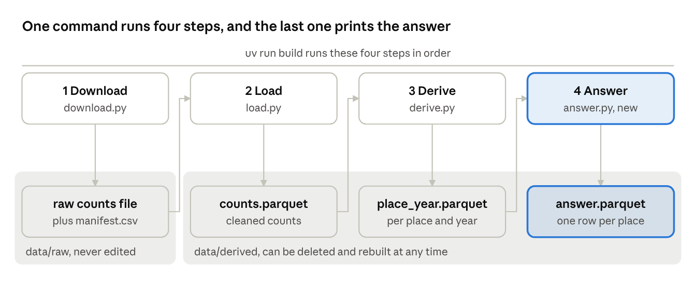

# DS-Projekt 2026 tutorial · Chapter 5 · From table to answer

Oct 9, 2026 · Václav Pechtor

## What you have at the end

After this chapter, one command ends in a sentence that answers the question:

> For the city: yes. 8 of 10 comparable places grew, 2 shrank, 0 are unchanged, 34 places cannot be compared.

Every number in it can be rebuilt with `uv run build`, and every rule behind it was written down before the result existed.

Chapter 3 ended with a table, and chapter 4 put checks around it. This chapter goes from the table to the answer in three pull requests:

- **A fix.** One flaw in the table is repaired. It starts as an issue and with a test that fails.
- **The rules.** What counts as comparable, as growth and as "yes" is decided before anything is compared.
- **The answer.** The pipeline gets a fourth step, and its printed line is the sentence above.



The first three steps are the ones from chapter 3. The fourth reads the table per place and year and writes one row per place.

The answer is honest about its reach. It covers 10 of 44 places and says so. How that came about is the middle of this chapter.

## A package starts as an issue, and a fix starts with a failing test

Before you repair something, write down what is wrong and how you will know that it is fixed. Then let a test show the flaw before the code changes.

**The flaw.** Chapter 3 left one known limit in the log: at one place, a single quarter hour was recorded under two site IDs and therefore counted twice. The fix is to count it once.

**The issue.** An issue is a note on GitHub that describes a piece of work before it is done. Ours has three parts: the problem, the decision and the check. The pull request refers to it, and merging the pull request closes it. Months later, the issue tells you why a change was made, and the pull request shows how.

The prompt:

```text
Pull request 5 is merged. Switch to main and pull.

Hardening package: the double-counted quarter hour from the known limit in
docs/log.md.

My decision: when a place has rows from more than one site ID for the same
quarter hour, that quarter hour counts once, with the highest of the counts.
Log it as a decision.

Open a GitHub issue for this package first, with the problem, the decision and
the check.
Then add this row to the fixture, next to the other rows for place 1000/2000 on
2020-03-01:

1,2020-03-01T08:00,3,0,,,1000,2000

The expected value for place 1000/2000 in 2020 becomes 7 bikes per day.
Show me that the test fails before you change derive, then fix it.
Afterwards tell me the effect on the real data: the 2017 row of place
2682278/1248325 before and after.
```

The prompt puts the work into an order, and the order is the lesson:

1. **Decide.** What should happen in this case is my decision, and it goes into the log.
2. **Write the issue.** Problem, decision, check.
3. **Build the case into the fixture.** One new row repeats a quarter hour of place 1000/2000 under a second site ID. That quarter hour now has 2 bikes under one ID and 3 under the other, so it should count as 3. With the 4 bikes of the next quarter hour, the day has 7.
4. **Watch the test fail.** The old code adds everything up and gets 9 where 7 is expected. Only now do you know that the test can see the flaw.
5. **Fix it.** The test turns green.
6. **Measure the effect on the real data.** The agent compared the whole table before and after. It still has 367 rows for 44 places, and exactly one row changed: from 4631.565714 to 4631.477143 bikes per day.

Step 4 is the same idea as testing the gate in chapter 4. A test that was written after the fix has never been red, so you do not know what it would catch.

Step 6 answers a different question than the test does. The test says the rule works on the fixture. The comparison says the fix changed what it should on the real data, and nothing else.

The effect here is tiny, less than a tenth of a bike per day at one place in one year. The procedure is the same when a fix moves a number by 20 percent, and then you will want it to be a habit.

Result: [issue 6](https://github.com/vp-82/ds-projekt-2026-tutorial/issues/6) and [pull request 7](https://github.com/vp-82/ds-projekt-2026-tutorial/pull/7). More on issues in GitHub's [About issues](https://docs.github.com/en/issues/tracking-your-work-with-issues/learning-about-issues/about-issues).

## The fixture settles what your words leave open

A sentence can be read in two ways. A row with an expected value cannot. So every decision about the data gets a row in the fixture.

The same pull request showed this three times.

**My wording had two readings.** I had written "the highest of the counts". The agent pointed out in its plan that this could mean the highest total of a site ID, or the highest value per direction. The first reading gives 7 bikes for the fixture, the second gives 8. My expected value was 7, so the agent took the first reading and said so. It did not have to guess, and I did not have to notice the gap in my own sentence.

**A second case looked the same and was not.** While checking the real data, the agent found 604 quarter hours with two rows from the same site ID. Almost all of them lie between 02:00 and 02:45 on the last Sunday in October. That is the hour that happens twice when the clocks go back, so those counts are real and have to add up. A first version of the fix would have collapsed them as well. The agent narrowed the fix to the case I had decided, and marked the other one as open. I then decided it: rows of the same site ID add up.

**A decision without a row is not tested.** That second decision went into the log and not into the fixture. Nothing would have failed if someone had later broken it. This is the gap that the `@claude` comment in chapter 4 closed, with one more row and the expected value 17.

The fixture is still small enough to read in one look, and each of its special rows stands for a decision:

| Row in the fixture | Decision it pins |
| --- | --- |
| Two site IDs at the same coordinates | Site IDs at the same coordinates form one place |
| A row with only one direction filled | The missing direction counts as 0 |
| A row with pedestrians only | Sites without bike counts do not appear |
| The same quarter hour under two site IDs | It counts once, with the highest total |
| The same quarter hour twice under one site ID | The rows add up |

When the agent asks what you meant, or when you take a decision about the data, the answer is a row and an expected value. A sentence in the chat is gone with the session.

Result: the fixture [counts\_small.csv](https://github.com/vp-82/ds-projekt-2026-tutorial/blob/main/tests/fixtures/counts_small.csv) and the two decisions of 2026-10-09 in the [log](https://github.com/vp-82/ds-projekt-2026-tutorial/blob/main/docs/log.md).

## Fix the rules for the answer before the result exists

If you choose the rules after you have seen the result, you can get any answer you like, even without meaning to. So the rules are decided first, and the repository shows that they were.

The table has one row per place and year. Turning it into a yes or a no needs decisions that the one-pager had left open since chapter 1: which years are compared, when a place counts, what counts as growth, and what makes the answer "yes".

These are the rules as they now stand in the one-pager:

| Rule | Decision |
| --- | --- |
| Years | 2025, the last full year, against 2019, the last full year before the pandemic |
| Days | A day counts when it has any bike data |
| Comparable | A place counts in a year with bike data on at least 300 days. It is comparable when that holds in both years |
| Change | Grew means more than 5 percent up, shrank means more than 5 percent down, unchanged lies in between |
| Answer for the city | Yes, when more than half of the comparable places grew |

Three things matter more than the numbers in that table:

- **The rules have their own pull request, and it holds no code.** It changes two files, the one-pager and the log. The git history shows the rules going in before any line of comparison code existed. Nobody has to take your word for the order.
- **The numbers are judgement calls.** There is no correct value for 300 days or 5 percent. What you owe the reader is that the values are stated, have a reason and were not tuned to the result.
- **A limit is named, not hidden.** A day with a partial outage counts as a full day and lowers the average. A stricter rule would be a package of its own, so the limit is written next to the rule.

The same order applies to your own project, whatever the method is. Decide the metric, the threshold and the split of your data before you look at the outcome, and commit that decision first.

Result: the rules in the [one-pager](https://github.com/vp-82/ds-projekt-2026-tutorial/blob/main/docs/one-pager.md) and [pull request 10](https://github.com/vp-82/ds-projekt-2026-tutorial/pull/10).

## A failed hypothesis can change the wording and leave the rules alone

When a test comes out worse than you expected, the honest move is often to keep the rules and say less with the answer.

The rules were fixed, and the answer step did not exist yet. One thing could still break the answer completely: too few places that can be compared. It was also cheap to test, with one count on the table that was already there. So it came first, as a hypothesis in the form from chapter 2.

| Part | Entry in the log |
| --- | --- |
| Hypothesis | Enough places are comparable to answer for the city |
| Expected | At least 20 of the 44 places |
| Test | Count the places with bike data on at least 300 days in both 2019 and 2025. Only the count, no change between the years |
| Result | 10 of 44. 14 places reach 300 days in 2019, 19 in 2025, and 10 in both |
| Decision | The rules stay. The answer names the 10 places it rests on and the 34 it cannot compare |

The expectation was wrong by half. Two ways out were open:

- **Change the rules until the number looks better.** Other years or fewer days would give more places. That would be choosing the rules after seeing the data, which the last section set out to prevent.
- **Keep the rules and limit the claim.** The answer is then about 10 places and says so in its own sentence.

I took the second. Finding a pair of years with more comparable places is a fair question, and it belongs to a later loop with its own hypothesis.

Compare this with chapter 2. There a failed hypothesis changed the plan: the unit of the table became the place and not the site ID. Here it changes how much the answer may claim. Both are results. A hypothesis that fails early has done its job, because it failed before the answer was built on it.

Note also what the test did not do. It counted places and computed no change between the years. So when the decision was taken, nobody knew yet whether the answer would be yes or no.

Result: the entry "Enough places are comparable to answer for the city" in the [log](https://github.com/vp-82/ds-projekt-2026-tutorial/blob/main/docs/log.md), in the same [pull request 10](https://github.com/vp-82/ds-projekt-2026-tutorial/pull/10).

## The answer step is a step like any other

The answer is not a special moment at the end. It is one more step in the pipeline, built and checked like the three before it.

The new step is called `answer`. It reads the table per place and year, applies the rules and writes one row per place: bikes per day in 2019 and in 2025, the change in percent, a status and, for a place that cannot be compared, the reason. Its printed line is the sentence for the city.

It follows the pattern from chapter 3: the logic sits in a function that takes a table and returns a table, the step prints one line, skips when its output exists and rebuilds with `--force`. This is how it was built and checked.

**The expectation went into the log first.** Before the step existed, the log got a hypothesis entry: at least 6 of the 10 comparable places grew.

**The rules are four named values at the top of the file.**

```
FIRST_YEAR = 2019
LAST_YEAR = 2025
MIN_DAYS = 300
BAND_PERCENT = 5.0
```

Each matches a line in the one-pager. Changing a rule later is a visible change of one line in a pull request, and no number is buried in the middle of the code.

**The fixture answers "no" on purpose.** It has five places, one for each case the rules can produce:

| Place in the fixture | 2019 | 2025 | The test must find |
| --- | --- | --- | --- |
| 1000/2000 | 100 bikes per day | 120 | Grew, plus 20 percent |
| 3000/4000 | 200 | 150 | Shrank, minus 25 percent |
| 5000/6000 | 100 | 103 | Unchanged, plus 3 percent |
| 7000/8000 | 50, on 120 days only | 80 | Not comparable: 2019 has fewer than 300 days |
| 9000/1000 | No data | 60 | Not comparable: 2019 has no data |

For the city this gives "no", because only 1 of 3 comparable places grew. The real data might say yes, and a test that only ever sees a yes would not notice a broken rule.

**One place was checked by hand.** This is the independent check from chapter 3 again. For one place I took the two rows from the table per place and year and a calculator: 863.84 bikes per day in 2019 and 1240.10 in 2025 give plus 43.56 percent. The new table says the same.

**The result.** 8 of the 10 comparable places grew, 2 shrank, and 34 cannot be compared. The expectation of at least 6 held. For the city the answer is yes.

The agent added one remark without being asked: one place grew by 5.43 percent, just above the band, and with a band of 6 percent the answer would still be yes, with 7 of 10. Because the band was fixed beforehand, this is a note on how stable the answer is and not a temptation to move the band.

**The decision says how far the answer reaches.** It is the last line of the hypothesis entry, and it is mine:

- Yes, cycling grew from 2019 to 2025 at 8 of the 10 places that can be compared.
- The answer covers these 10 places only and says nothing about the other 34.
- Whether the counting places stand for the whole city stays an untested assumption.

No place was dropped silently. Each of the 44 has either a value or a stated reason, which is what the one-pager asked for under "Done" in chapter 1.

The pull request came to 184 lines, just under the limit. The tests passed, and the review answered "No issues found".

Result: [answer.py](https://github.com/vp-82/ds-projekt-2026-tutorial/blob/main/src/ds_projekt_2026_tutorial/answer.py), the fixture [place\_year\_small.csv](https://github.com/vp-82/ds-projekt-2026-tutorial/blob/main/tests/fixtures/place_year_small.csv) and [pull request 12](https://github.com/vp-82/ds-projekt-2026-tutorial/pull/12).

## Three kinds of packages

Every package so far was one of three kinds. Knowing which kind you are in tells you what the package leaves behind and when it is done.

| Kind | Question it answers | What it leaves in the repository | How you know it is done |
| --- | --- | --- | --- |
| **Find out** | Is this true? What should the rule be? | An entry in the log, sometimes a changed one-pager. No pipeline code | The expectation was written before the test, and a decision follows from the result |
| **Keep it** | How do I get this result again, from nothing? | A pipeline step with a fixture and a test | The test passes on the fixture, and one independent check agrees on the real data |
| **Harden it** | Can I trust what is already there? | A fix, a check or a rule. The answer usually stays the same | The check was seen failing once, and it passes now |

The packages of this tutorial, sorted:

| Kind | Packages |
| --- | --- |
| Find out | The hypothesis about the counting sites in chapter 2. The rules for the answer and the count of comparable places, pull request 10 |
| Keep it | The command and the download step. Load and derive, pull request 1. The answer step, pull request 12 |
| Harden it | The rules file, pull requests 2 and 13. CI, pull request 3. The review setup, pull request 5. The double-counted quarter hour, pull request 7. The skipped review check, pull request 9 |

Three things follow from this:

- **Exploring is not a package, and its result is.** This is the rule from chapter 3. The notebook work behind a find-out package stays out of the pull request. The entry in the log is what goes in.
- **One kind per package.** A pull request that explores, builds and repairs at once has no single purpose, and nobody can say when it is done.
- **Hardening is most of the work.** Six of the nine merged pull requests added nothing to the answer. They are the reason the answer can be rebuilt, checked and trusted. Plan for that share in your own project. It is what separates a result from a notebook that once produced a number.

A loop usually runs through the kinds in this order: find out, keep it, harden it. Loop one is now done. Loop two asks whether the answer holds on dry weekdays. It needs a second data source, and it will pass through the same three kinds.

## For your own project

1. Before a fix, write an issue with the problem, your decision and the check.
2. Put the case into the fixture with its expected value, and watch the test fail before the code changes.
3. After the fix, compare the result on the real data before and after. Every changed row needs an explanation.
4. Give every decision about the data a row in the fixture.
5. Decide the rules for your result before you compute it, and merge them in a pull request of their own.
6. Test first what could break the result, with your expectation written down. When it fails, limit the claim before you touch the rules.
7. Build the result as a pipeline step: the rules as named values, a fixture with every case, and one value checked by hand.
8. Write into the result what it covers and what it does not.
9. Before each package, say which kind it is: find out, keep it or harden it.

---

Previous: [Chapter 4 · Checks that run without you](chapter-4.md) · [Overview](README.md)
